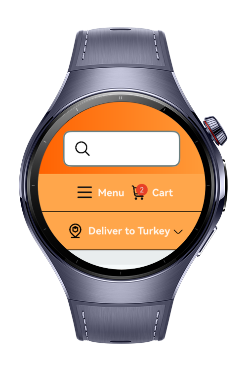
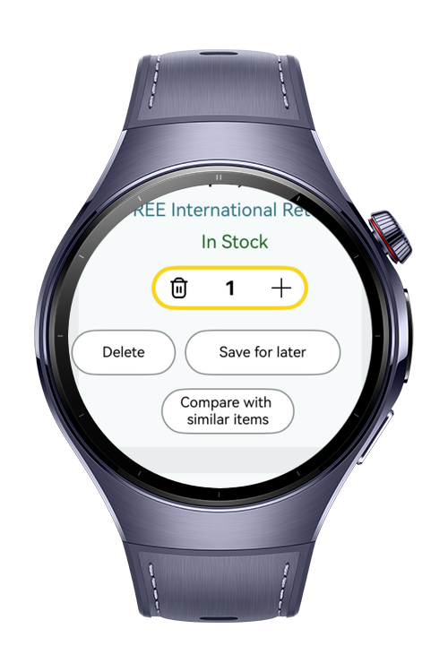
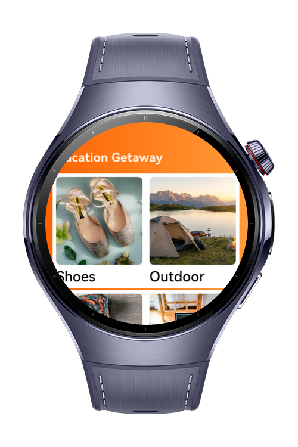

> **Note:** To access all shared projects, get information about environment setup, and view other guides, please visit [Explore-In-HMOS-Wearable Index](https://github.com/Explore-In-HMOS-Wearable/hmos-index).

# Shopping App
E-commerce app on your watch.

# Preview

<div>
  
  
  
  
</div>

# Use Cases

- View products
- Add Products to cart
- Change delivery address

# Tech Stack 

- **Languages**: ArkTS, Typescript
- **Frameworks**: HarmonyOS SDK 6.0.1(21)
- **Tools**: DevEco Studio Version 6.0.1(21)
- **Libraries**:
    - `@kit.ArkUI`
    - `@kit.AbilityKit`
    - `@kit.BasicServicesKit`

# Directory Structure

```
├── entry/src/main/ets/
│   ├──common
│   │  ├──Constants.ets
│   │  └──RouterUtils.ets
│   ├──components
│   │  └──cart
│   │        ├──CartItemComponent.ets
│   │        ├──PreOrderProductCard.ets
│   │        ├──ProductCard.ets
│   │        ├──ProductGroupComponent.ets
│   │        └──ShoppingButtonComponent.ets
│   │  └──home
│   │        ├──CustomCategoryComponent.ets
│   │        └──TopProductListItemComponent.ets
│   │  └──menu
│   │        └──MenuItemComponent.ets
│   │  └──productlist
│   │        ├──FilterButtonComponent
│   │        ├──ProductCategory
│   │        ├──ProductCategoryComponent
│   │        ├──ProductListingItem
│   │        └──TabFilterComponent
│   │  └──profile
│   │        └──CustomToolBar.ets
│   │  ├──AppMenuComponent.ets
│   │  ├──DeliveryToComponent.ets
│   │  └──SearchBar.ets
│   ├──data
│   │  ├──CategoryItemModel.ets
│   │  ├──FilterModel.ets
│   │  ├──InfoModel.ets
│   │  ├──MovieModel.ets
│   │  ├──ProductCategoryModel.ets
│   │  ├──ProductModel.ets
│   │  └──UserInfoModel.ets
│   ├──entryability/
│   │  └──EntryAbility.ets              // Main entry point ability
│   ├──entrybackupability/
│   │  └──EntryBackupAbility.ets        // Backup entry ability
│   ├──pages/
│   │  ├──Index.ets                     // App start page / navigation root
│   │  └──cart
│   │      └──afterSignin
│   │          ├──CartScreenAfterSignIn.ets
│   │          ├──EmptyCartBodyAfterSignIn.ets
│   │      └──withoutSignin
│   │          ├──CartScreenWithoutSignIn.ets
│   │          ├──EmptyCartBody.ets
│   │      └──CartScreen.ets
│   │   └──home
│   │      └──HomeScreen.ets
│   │   └──menu
│   │      └──MenuScreen.ets
│   │   └──productlist
│   │      └──ProductListPage
│   │   └──profile
│   │      └──withoutSignin
│   │          ├──InformationItemComponent.ets
│   │          ├──ProfileWithoutSignIn.ets
│   │      └──withSignin
│   │          ├──ProfileWithSignIn.ets
│   │      └──ProductListPage
│   │   └──signin
│   │      ├──SignInPasswordScreen.ets
│   │      └──SignInScreen.ets
│   ├──service
│   │      └──NavigationService.ets
│   ├──viewMODEL
│   │      ├──CartViewModel.ets
│   │      ├──HomeViewModel.ets
│   │      └──ProductViewModel.ets
```

# Constraints and Restrictions
## Supported Devices
- Huawei Watch 5
- DevEco Studio Simulator

# LICENSE
**Shopping App** is distributed under the terms of the MIT License.
See the [LICENSE](/LICENSE) for more information.
